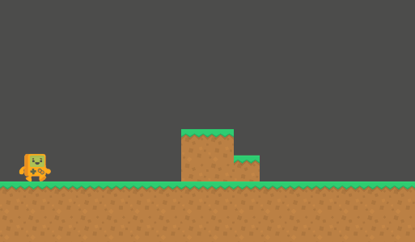
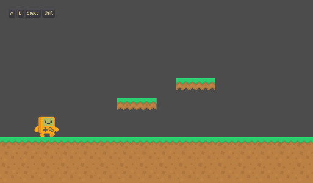
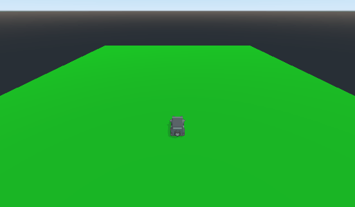
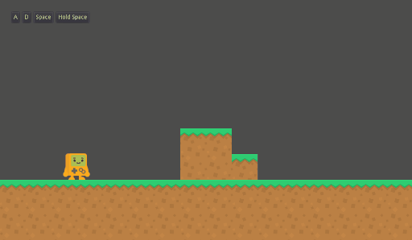

# Godot Mechanics Lab

[](https://godotengine.org/)

v3.3.2

## Description

This project contains a series of experiments, scripts and studies I've made in Godot through all this years.

Every demo scene implements an unique and isolated mechanic you can use as example or as base for your studies in this amazing engine.

Enjoy! 👾

## Demo scenes

### 001 - Parallax Background

- No scripts required, you can made parallax effects in Godot only using the `ParallaxBackground` and `ParallaxLayer` nodes


### 002 - Look at Mouse Position

- It's simple to make a Node always "look" at the mouse position, just use the `look_at()` function

```gd
func _process(delta):
	look_at(get_global_mouse_position())
```


### 003 - Create Tilesets

- To create a tileset, create your Nodes in a separate scene, and convert the whole scene in menu `Scene -> Convert To -> TileSet`


### 004 - Using Tilesets

- To use a tilemap to create your levels, add a `Tilemap` Node in your scene, and load the tileset created in last step


### 005 - Basic Player

- This is the most simple and basic 2D platform player you can have. He can walk, he can jump, and have Idle, walking, and jumping animations. You can check the code [here](https://github.com/renanstn/godot-mechanics/blob/master/Mechanics%20Lab/Scripts/SimplePlayer.gd)



### 006 - Slow Motion Effect

- In this example, I tried to simulate a slow motion effect, just changing gradativally the `time_scale` value of the engine. You can check the code [here](https://github.com/renanstn/godot-mechanics/blob/master/Mechanics%20Lab/Scripts/SlowMotionEffect.gd)



### 007 - Arcade Car 3D

- This example implements a 3D arcade race car mechanic. This technique uses a sphere to run all the physics, and visually replace the sphere for the car 3D model
- This technique I've learned from [this](https://kidscancode.org/godot_recipes/3d/3d_sphere_car/) amazing tutorial site



### 008 - Advanced Player

- In this new character script, gravity is not a fixed value randomly chosen by you. Instead, you set the blocks `UNIT_SIZE` of your tilemap, and all values will be calculated according to your blocks
- This way, it's more easy to control how high (in blocks) and how distance (in blocks) your character can reach in a jump
- Holding the "jump" button will make your character jump higher
- This player also had a `Tween` node to make some cool animations when you're jumping and when you're landing. You can configure how much the character will "deform" changing the "squash" value.



## Assets:

- [Kenney](https://www.kenney.nl/assets/simplified-platformer-pack)
- [The Spriters Resource](https://www.spriters-resource.com/)
- [Sound Bible](http://soundbible.com/)
